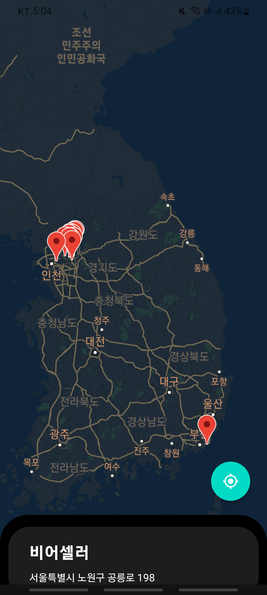
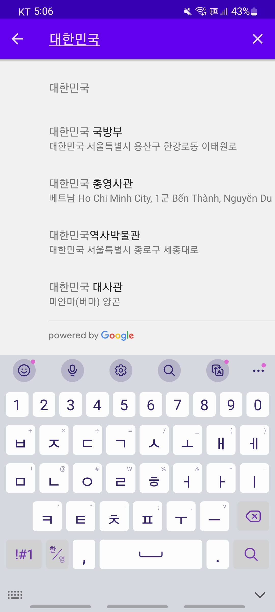

  
# **BeerMap Android**
## **USED DATA FROM**
- ### It's Me.
## **Short Usage shot**
<video src="Image\movie\beerMap_SUS.mp4" width="270" controls></video>

## **MainActivity**
- ### 메인화면

   

- ### 마커 클릭 시

 

## **AddPubFragment**
  

  

## **Introduce**
제가 방문했던 맥주Pub의 위치 및 간략한 정보들을 표시하는 Android App입니다.

지금까지 사용해오던 **MVC(라고 불리지만 M-VC 같은)** 패턴에서 벗어나 **MVVM**으로 개발을 진행하였습니다.

**Google Map**과 Firebase의 Realtime Database를 이용하여 구성했습니다.

처음부터 MVVM으로 진행하기 보다는 MVC TO MVVM으로 진행하며 Activity/Fragment의 onCreate()의 코드가 다이어트 되는 광경을 보는 재미로 작업했습니다.

과거에 제작했던 [BeerMap Web](https://github.com/NamJa/BeerMap_WEB)과 연동됩니다.

**Skill** : 
 - MVVM, MVC
 - Android 
 - Google Maps 
 - Google Firebase 

## **Libraries & skill**
- [Google Maps SDK](https://developers.google.com/maps/documentation/android-sdk/overview?hl=ko)
- [Geocoding API](https://developers.google.com/maps/documentation/geocoding/start?hl=ko)
- [Places API](https://developers.google.com/maps/documentation/places/web-service/overview?hl=ko)
- [LifeCycle-Extensions](https://developer.android.com/jetpack/androidx/releases/lifecycle?hl=ko)
- [DataBinding](https://developer.android.com/topic/libraries/data-binding)
- [Material UI](https://material.io/)
- [Google Firebase](https://firebase.google.com/docs/android/setup)
- [Google Firebase - Realtime Database](https://firebase.google.com/docs/database)

## **프로젝트 진행 내역**

- [Project Concepts](https://docs.google.com/presentation/d/1lxIZT7Rb1X200OYIvEerIGleVQekBZOM/edit?usp=sharing&ouid=111098954105583461878&rtpof=true&sd=true)
굵직한 주요 작업 내역을 기록했습니다.
- [Project TodoList](https://github.com/NamJa/BeerMap_Android/projects/1)
